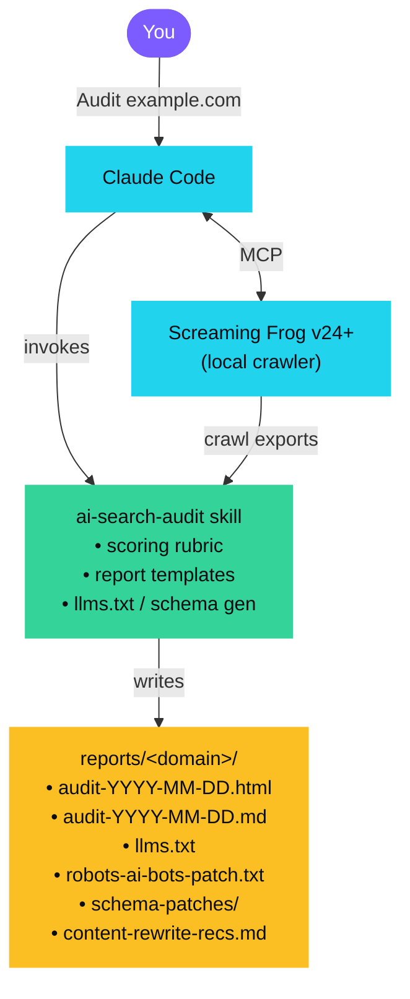

# ai-search-auditor

Find out whether ChatGPT, Claude, Perplexity, and Google AI Overviews will cite your site, and get a concrete, prioritized fix list to make sure they will.

Powered by [Screaming Frog SEO Spider](https://www.screamingfrog.co.uk/seo-spider/) (via its native v24+ MCP server) and [Claude](https://claude.com/claude-code). Open source, deterministic scoring, no SaaS account, no API keys.

---

## Why this exists

SEO tools score you on Google. None score you on the engines your buyers are actually using to find answers.

In 2026 your prospects are searching in ChatGPT and Perplexity. Google's AI Overviews now serve over half of search sessions in some verticals. The signals these engines use to decide who to cite are **measurable** (bot access, schema, citability patterns, authority markup), but no one has open-sourced an end-to-end audit for them. So I did.

This repo gives you:

- **A Claude Code skill** (`ai-search-audit`) that runs a full audit by chatting with Claude.
- **A deterministic 100-point scoring rubric** across 5 dimensions. Auditable, not vibes.
- **Generated fix artifacts**: a ready-to-deploy `llms.txt`, a robots.txt patch for AI crawlers, schema JSON-LD patches, and per-page content-rewrite recommendations.
- **A Screaming Frog MCP integration** that does the crawl. No browser automation, no scraping. Screaming Frog is the industry-standard crawler and the MCP gives Claude programmatic access.

---

## What gets audited

Five dimensions, scored 0-20 each, total out of 100. Full rubric: [`.claude/skills/ai-search-audit/rubric.md`](.claude/skills/ai-search-audit/rubric.md).

| Dimension | What it checks |
|---|---|
| **Bot Access** | Is GPTBot, ClaudeBot, PerplexityBot, Google-Extended, Applebot-Extended allowed in `robots.txt`? |
| **Discovery** | `llms.txt`, `llms-full.txt`, sitemap, canonical hygiene, RSS. |
| **Structure** | Schema.org coverage (Article, FAQPage, HowTo, Organization, Person, BreadcrumbList), heading hierarchy, semantic landmarks. |
| **Citability** | Definitive answers up top, Q&A blocks, named entities, dates, primary-source citations, content length sweet spot. |
| **Authority** | Visible author bylines, Person schema, About page reachable, links to primary research, Wikipedia-tier `sameAs`. |

Pages bucket into **Strong (80-100)**, **Decent (60-79)**, **Weak (40-59)**, **Invisible (0-39)**.

---

## Install

### Prerequisites

- [Screaming Frog SEO Spider](https://www.screamingfrog.co.uk/seo-spider/) **v24.0 or later** with a valid license. The v24 release introduced the native MCP server.
- [Claude Code](https://docs.claude.com/en/docs/agents-and-tools/claude-code/overview) installed.
- Node.js 20+ (only if you use the community MCP fallback).

### Clone

```bash
git clone https://github.com/<your-username>/ai-search-auditor.git
cd ai-search-auditor
```

### Wire up the MCP server

The repo ships with `.mcp.json` configured for the **macOS native v24+ MCP server**. If that's you, no edits needed.

**Windows**: copy `.mcp.json.windows-example` over `.mcp.json` and adjust the binary path if your install is non-default.

**Free tier / community server**: copy `.mcp.json.community-example` over `.mcp.json`. This uses the community MCP server which works without a SF license (but is subject to the 500-URL free-tier cap).

Verify the MCP server is reachable:

```bash
claude mcp list
```

You should see `screaming-frog` in the output.

---

## Quickstart

Open Claude Code in the repo:

```bash
claude
```

Then ask:

```
Audit example.com for AI search readiness.
```

Claude will invoke the `ai-search-audit` skill, run the crawl through Screaming Frog MCP, score every page, and write your full report + artifacts to `reports/example.com/`.

Typical audit on a 500-URL site takes 3-6 minutes.

### What you get

```
reports/example.com/
├── audit-2026-05-26.html            ← Shareable HTML one-pager (open in browser)
├── audit-2026-05-26.md              ← Same content as markdown for git / PRs
├── llms.txt                         ← Drop-in file for your site root
├── robots-ai-bots-patch.txt         ← Block to merge into your robots.txt
├── schema-patches/
│   ├── pricing.json                 ← JSON-LD ready to embed
│   ├── about.json
│   └── ...
└── content-rewrite-recs.md          ← Page-by-page first-paragraph rewrites
```

The HTML one-pager is the shareable artifact: self-contained, zero dependencies, dark/light auto-themes, prints clean to PDF, screenshot-friendly for LinkedIn / Slack.

---

## Example output

- **[HTML one-pager preview](examples/sample-audit-example.com.html)**: open in browser to see the polished report.
- [Markdown version](examples/sample-audit-example.com.md): same data, plain markdown.

---

## Custom scoping

The skill accepts these scoping inputs in your prompt:

- `Audit only the /blog section of example.com`
- `Audit example.com with JS rendering on` (for SPAs)
- `Audit example.com, cap at 100 URLs`
- `Audit example.com vs anthropic.com` (comparison mode, runs both, side-by-side scorecard)

---

## How the scoring works

Every score is traceable to a specific crawl observation. No magic, no LLM-as-judge guessing.

Example: a page scores 14/20 on Citability because:
- [+] Definitive answer in first 100 words (+5)
- [+] Has bulleted list of facts (+2)
- [+] Named entities present (+2)
- [+] Publish + updated dates visible (+2)
- [+] Body in 300-3000 word sweet spot (+2)
- [+] First paragraph contains a concrete number (+1)
- [-] No Q&A section (-3)
- [-] No cited external sources (-3)

The full per-page breakdown is in the audit report.

---

## Architecture



Crawl happens locally. No site data leaves your machine except what you send to Claude.

---

## Roadmap

- [ ] Comparison mode (your site vs N competitors)
- [ ] Wayback Machine integration: track AI search readiness over time
- [ ] GitHub Action: gate PRs on AI search readiness regression
- [ ] HTML report renderer for stakeholder sharing
- [ ] Citation tracking: measure actual citations in Perplexity / ChatGPT Search over time

PRs welcome.

---

## License

MIT. See [LICENSE](LICENSE).

---

## Credits

- [Screaming Frog](https://www.screamingfrog.co.uk/) for shipping a native MCP server in v24.
- [llmstxt.org](https://llmstxt.org/) for the `llms.txt` spec.
- [ai.robots.txt](https://github.com/ai-robots-txt/ai.robots.txt) for the AI crawler reference list.
- The community MCP server forks: [bzsasson/screaming-frog-mcp](https://github.com/bzsasson/screaming-frog-mcp), [marykovziridze/screaming-frog-mcp](https://github.com/marykovziridze/screaming-frog-mcp).
